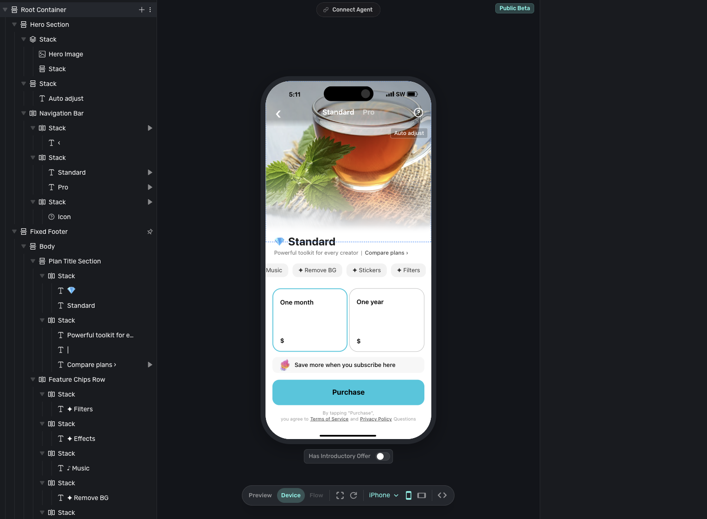

# Superwall Alternatives for Indie iOS Apps

**Mode:** net-new · **Proposed URL:** `https://indieappstack.com/comparisons/superwall-alternatives-ios-apps`
**Target query:** `superwall alternatives` · **Intent:** commercial investigation
**Pillar:** Correct The Record · **Funnel stage:** Decision · **Goal:** Non-branded organic + AI-cited sessions; first earned citations
**CTA (single):** See the subscription-consumer stack → `/stacks/subscription-consumer-app`
**Draft date:** 2026-08-13 · **Planned publish date:** 2026-08-18 · **All prices checked:** 2026-08-13

---

## How to publish this

Create a new comparison page with the proposed slug. The current site is database-backed; add the article to the content source, seed the hosted database, and redeploy the statically generated site. Use `Article` and `BreadcrumbList` schema. The FAQ is written for readers and answer extraction, not as a promise of an FAQ rich result.

The real Superwall editor capture is ready. Two narrower gates remain: the supplied campaign screen does not show a placement or assigned paywall, and the direct AlternativeTo URL's 404 observed in one browser on Aug 14, 2026 still needs a second-browser or independent-network reproduction before that dated claim is published.

## CMS fields

**Title / H1**

```text
Superwall Alternatives for Indie iOS Apps
```

**Subtitle**

```text
Choose by the job and the pricing meter, not by a generic feature list.
```

**Excerpt**

```text
Compare RevenueCat, Adapty, Qonversion, and native StoreKit 2 as Superwall alternatives for an indie iOS subscription app.
```

**SEO title** — 41 characters

```text
Superwall Alternatives for Indie iOS Apps
```

**SEO description** — 122 characters

```text
Compare RevenueCat, Adapty, Qonversion, and StoreKit 2 by pricing, paywall workflow, and fit. Prices checked Aug 13, 2026.
```

## `body_markdown`

```markdown
## Short answer

The practical Superwall alternatives for an indie iOS app are RevenueCat when purchase and entitlement infrastructure is the priority, Adapty when paywall analytics and experimentation should live together, and Qonversion when a lower percentage meter matters. For a simple Apple-only app, native StoreKit 2 may fit better than another platform.

The first question is not “Which tool has paywalls?” They all do. Ask which job you need the tool to own, then compare the revenue meter attached to that job.



*Superwall’s real paywall editor, with the component tree beside an iPhone paywall preview. Captured Aug 14, 2026. The separate campaign capture is not used here because it shows no placements or paywalls.*

## Which Superwall alternatives are worth comparing?

Use this shortlist for a solo or small-team iOS subscription app:

- Choose [RevenueCat](/tools/revenuecat) when purchases, entitlements, and cross-platform customer state should be the boring foundation.
- Choose [Adapty](/tools/adapty) when a growth workflow needs paywall building, onboarding, experiments, and subscription analytics in one place.
- Choose [Qonversion](/tools/qonversion) when you want subscription infrastructure and paywalls together, but the percentage meter and tier boundaries deserve more weight.
- Choose native StoreKit 2 when the app is Apple-only, the product catalog is small, and remote paywall iteration is not yet a real job.

Superwall remains a valid choice. Its current platform includes entitlements, purchase APIs, receipt validation, webhooks, analytics, paywalls, and experiments. Its infrastructure layer is free at any scale, while the paywall product is metered on revenue attributed to Superwall-rendered paywalls. Switching because you think Superwall is only a presentation SDK would solve an outdated problem.

## How do Superwall, RevenueCat, Adapty, Qonversion, and StoreKit 2 compare on price?

:::comparison Subscription and paywall pricing (checked Aug 13, 2026)

| Option | Free boundary | Paid meter | What the meter means |
| --- | --- | --- | --- |
| [Superwall](/tools/superwall) | Infrastructure is free at any scale; paywalls are free up to $10,000 in monthly paywall-attributed revenue | 1% of paywall-attributed revenue after the free boundary | The paid base is revenue converted through a Superwall-rendered paywall, not every subscription dollar the platform observes |
| [RevenueCat](/tools/revenuecat) | Free up to $2,500 in monthly tracked revenue | 1% of tracked revenue after the free boundary | The meter follows active subscriptions RevenueCat monitors; separate growth tools can also sit on your own infrastructure |
| [Adapty](/tools/adapty) | Free while monthly revenue stays under $5,000 | 1% of monthly revenue after crossing $5,000 | The Pro platform bundles infrastructure, analytics, paywalls, and experiments; add-ons can carry separate charges |
| [Qonversion](/tools/qonversion) | Free up to $10,000 in monthly tracked revenue | Starter is 0.6% of revenue; Growth is 0.8% | Starter adds advanced analytics and webhooks; Growth is the relevant comparison for Superwall-style A/B experiments |
| Native StoreKit 2 | No third-party subscription-platform fee | Your engineering and operations time | Apple still owns App Store commerce; you own the implementation, lifecycle handling, reporting, and any server-side subscription state |

:::

Prices and plan boundaries were checked Aug 13, 2026, against the official [Superwall](https://superwall.com/pricing), [RevenueCat](https://www.revenuecat.com/pricing), [Adapty](https://adapty.io/pricing/), and [Qonversion](https://qonversion.io/pricing) pricing pages. Recheck them before committing spend.

The headline percentages hide the useful difference: **the base matters as much as the rate**. Superwall meters paywall-attributed revenue. RevenueCat and Adapty meter the subscription revenue they track. Qonversion advertises a lower rate, but its 0.6% Starter plan does not include A/B experiments; the 0.8% Growth plan is the closer replacement for Superwall's core experimentation job.

## Why do generic Superwall alternatives lists get the decision wrong?

They compare labels that no longer separate the products.

“Subscription infrastructure” and “paywall SDK” used to describe different layers. The category has converged. Superwall, RevenueCat, Adapty, and Qonversion now overlap across purchases, entitlement state, remote paywalls, analytics, and experiments. A checklist that awards one point for every shared feature produces a tie and hides the tradeoff.

Use 3 harder questions instead:

1. **What is the source of truth?** Decide which system tells the app whether a customer has access.
2. **What changes without an app release?** Paywall layout, copy, targeting, offers, and experiment rules only matter if you will use that operating loop.
3. **Which revenue does the vendor meter?** “1%” is incomplete until you know whether it applies to all tracked revenue or only paywall-attributed revenue.

[[verify: A user-provided normal-browser capture shows https://alternativeto.net/software/superwall/ returning “404 – Page not found” on Aug 14, 2026. Reproduce that direct-URL result in a second browser or independent network before publishing the narrow dated claim. Do not broaden it into “AlternativeTo has no Superwall listing”; the internal-search capture shows only partial visible results and cannot prove absence.]]

## When is RevenueCat the right Superwall alternative?

Choose RevenueCat when purchase and entitlement truth is the first job.

RevenueCat models products, offerings, and entitlements, then exposes customer state through its SDKs. Its paywalls can be configured remotely, and its current pricing page also offers growth tools for teams that keep their own in-app purchase infrastructure. The reason to choose it is not that Superwall lacks infrastructure. It is that you want RevenueCat's purchase and customer model to sit at the center of the stack.

RevenueCat fits when:

- the app already uses RevenueCat and a migration would create more risk than value;
- iOS is only the first store, not the last;
- entitlements and customer state matter more than the paywall editor; or
- you want the [subscription MVP stack](/guides/subscription-mvp-stack-solo-ios-app) to keep one established purchase ledger.

Do not switch for feature-count comfort. At $2,500 in monthly tracked revenue, RevenueCat's free boundary is lower than the other hosted options in this table. Model the meter against your expected revenue before deciding that familiarity is cheaper.

## When is Adapty the right Superwall alternative?

Choose Adapty when paywall work belongs beside subscription analytics.

Adapty combines subscription infrastructure with a flow and paywall builder, targeting, A/B testing, and revenue analytics. Its documentation now directs new projects toward Flow Builder rather than the legacy Paywall Builder. That makes it a practical fit when one person or a small growth team will routinely connect onboarding, paywall variants, cohort behavior, and revenue outcomes.

Adapty fits when:

- onboarding and paywall experiments are one workflow;
- revenue, retention, churn, and lifetime-value analysis should sit beside the experiment;
- non-engineers need to change the monetization flow; or
- 1% of monthly revenue after the $5,000 boundary matches the value of the bundled workflow.

It is more platform than a quiet app with one product and one stable paywall needs. If you cannot name the next experiment, do not buy an experimentation workflow yet.

## When is Qonversion the right Superwall alternative?

Choose Qonversion when the bundled platform fits and the meter is the deciding constraint.

The free tier includes subscription SDKs, basic analytics, customer management, a no-code paywall builder, and unlimited apps and seats up to $10,000 in monthly tracked revenue. Starter adds advanced analytics, integrations, and webhooks at 0.6% of revenue. Growth adds A/B experiments, raw data export, and additional integrations at 0.8%.

That tier line matters. If you need to replace Superwall's remote paywall presentation but not its experiments, Starter may be enough. If experiments are the reason you are leaving, compare Superwall against Growth, not the cheaper headline rate.

Qonversion fits when:

- you want a broad subscription bundle with a higher free boundary;
- 0.6% to 0.8% is material at the revenue level you expect;
- the features you need map cleanly to Starter or Growth; and
- you are willing to evaluate a less familiar workflow on its own merits rather than treating popularity as proof.

## When should you use StoreKit 2 instead of any paywall platform?

Use StoreKit 2 directly when the app is Apple-only, sells a small number of products, and does not need remote paywall experiments.

StoreKit 2 provides Swift APIs for products, transactions, entitlement status, subscription state, and SwiftUI merchandising views. The App Store Server API can return transaction history and current subscription status from your server. That is enough to build a reliable purchase path without paying a third-party platform percentage.

The tradeoff is ownership. You design the data model, handle transaction updates and restores, react to refunds and billing states, build reporting, and operate any server-side subscription logic. Native is the smallest vendor footprint, not automatically the smallest engineering responsibility.

StoreKit-only fits when:

- the app ships only on Apple platforms;
- one or two products unlock one entitlement;
- the paywall changes with app releases, not every week;
- cross-platform identity is not required; and
- you are comfortable maintaining the subscription lifecycle.

Add a hosted platform when the missing job becomes concrete: shared entitlements across stores, remote paywall changes, experiment assignment, revenue analytics, customer support tooling, or reliable webhooks you do not want to operate.

## When should you run Superwall and RevenueCat together?

Run both when RevenueCat already owns purchase truth and Superwall has a distinct job: paywall presentation, targeting, and experimentation.

This is a supported integration, not an improvised stack. RevenueCat can send subscription and revenue events to Superwall, while Superwall's purchase controller can route purchase and restore logic through RevenueCat. The important rule is still simple: one system owns entitlement truth, and both SDKs use the same customer identifier.

The dual stack fits when:

- RevenueCat is already proven in production;
- the team wants Superwall's paywall workflow without migrating subscriber state;
- the added SDK, dashboard, identity mapping, and event reconciliation have a named owner; and
- paywall traffic is high enough for experiments to produce useful evidence.

Do not start with two platforms just because the integration exists. Superwall can now run as the subscription backend on its own, and RevenueCat has its own paywall and growth tools. A greenfield app should need a specific capability before it accepts two sources of configuration.

For a deeper version of this exact boundary, read [Superwall vs RevenueCat](/comparisons/superwall-vs-revenuecat). For the broader category, compare the [current iOS paywall tools](/guides/best-paywall-tools-ios-apps).

## Which Superwall alternative should an indie iOS developer choose?

Use this order:

- **RevenueCat:** choose purchase and entitlement infrastructure first.
- **Adapty:** choose an analytics-led paywall and onboarding workflow.
- **Qonversion:** choose the bundled platform when its tier and percentage meter fit better.
- **StoreKit 2:** choose no third-party platform when the app is simple enough to own the lifecycle.
- **Superwall plus RevenueCat:** keep both only when each has one explicit job.

The quiet answer is often to keep Superwall. Its product boundary changed: it can now own the subscription backend as well as the paywall. Switch only when another option gives one decision area a clearer owner, a better operating workflow, or a meter that fits how the app earns.

## Frequently asked questions

### Can Superwall replace RevenueCat?

Yes. Superwall's current subscription infrastructure includes entitlements, purchase APIs, receipt validation, webhooks, analytics, and SQL access, and that layer is advertised as free at any scale. RevenueCat remains a valid choice when you prefer its purchase and customer model or already rely on it in production.

### Is RevenueCat a direct Superwall competitor?

Increasingly, yes. Both now offer subscription infrastructure, remote paywalls, and growth tooling. They still lead with different operating models: RevenueCat centers purchase and entitlement infrastructure, while Superwall centers paywall presentation and experimentation.

### Which Superwall alternative has the lowest percentage fee?

Qonversion advertises 0.6% on Starter and 0.8% on Growth after its free boundary, compared with 1% meters on RevenueCat, Adapty, and Superwall. The bases and included features differ. Superwall charges on paywall-attributed revenue, and Qonversion reserves A/B experiments for Growth, so the lowest percentage is not automatically the lowest bill for your use case.

### Is StoreKit 2 free?

StoreKit 2 adds no third-party subscription-platform fee. Apple still owns App Store commerce, and you still pay with engineering and operating time for purchase state, lifecycle handling, reporting, and any server component you build.

## Source checks

Product and pricing claims were checked against official sources on Aug 13, 2026:

- [Superwall pricing](https://superwall.com/pricing)
- [Superwall documentation](https://superwall.com/docs/)
- [Superwall purchase controller](https://superwall.com/docs/ios/sdk-reference/PurchaseController)
- [Superwall guide to using RevenueCat](https://superwall.com/docs/ios/guides/using-revenuecat)
- [RevenueCat pricing](https://www.revenuecat.com/pricing)
- [RevenueCat offerings](https://www.revenuecat.com/docs/offerings/overview)
- [RevenueCat entitlements](https://www.revenuecat.com/docs/getting-started/entitlements)
- [RevenueCat's Superwall integration](https://www.revenuecat.com/docs/integrations/third-party-integrations/superwall)
- [Adapty pricing](https://adapty.io/pricing/)
- [Adapty paywall setup](https://adapty.io/docs/quickstart-paywalls)
- [Qonversion pricing](https://qonversion.io/pricing)
- [Qonversion experiments](https://documentation.qonversion.io/docs/paywall-experiments)
- [Apple StoreKit 2](https://developer.apple.com/storekit/)
- [Apple App Store Server API](https://developer.apple.com/documentation/appstoreserverapi/)

No hands-on testing claim is made. Prices, plan boundaries, and product capabilities can change; verify them again before publishing a later revision. A user-provided capture shows the direct AlternativeTo Superwall URL returning 404 on Aug 14, 2026, but the article excludes that statement until a second environment reproduces it. The capture does not prove that no listing exists under another URL.

See the [subscription-consumer stack](/stacks/subscription-consumer-app) to place the paywall, purchase ledger, analytics, and backend into one lean iOS setup.

Last checked: Aug 13, 2026.
```

---

## Fact ledger

| Claim as written | Type | Provenance | Source (retrieved) | Status |
| --- | --- | --- | --- | --- |
| Superwall's subscription infrastructure is free at any scale; its paywall product is free up to $10,000 monthly paywall-attributed revenue, then 1% of paywall-attributed revenue | sourced | measured | [Superwall pricing](https://superwall.com/pricing), 2026-08-13 | verified |
| Superwall currently includes entitlements, purchase APIs, receipt validation, webhooks, analytics, SQL access, paywalls, and experiments | sourced | measured | [Superwall pricing](https://superwall.com/pricing), 2026-08-13 | verified |
| RevenueCat is free up to $2,500 monthly tracked revenue, then charges 1% of tracked revenue | sourced | measured | [RevenueCat pricing](https://www.revenuecat.com/pricing), 2026-08-13 | verified |
| RevenueCat models offerings and entitlements and can pair a remotely configured paywall with an offering | sourced | measured | [RevenueCat offerings](https://www.revenuecat.com/docs/offerings/overview) and [entitlements](https://www.revenuecat.com/docs/getting-started/entitlements), 2026-08-13 | verified |
| Adapty is free under $5,000 monthly revenue, then charges 1% of monthly revenue | sourced | measured | [Adapty pricing](https://adapty.io/pricing/), 2026-08-13 | verified |
| Adapty offers remote paywall and flow configuration, A/B tests, and subscription analytics; new projects are directed to Flow Builder | sourced | measured | [Adapty paywall setup](https://adapty.io/docs/quickstart-paywalls) and [pricing](https://adapty.io/pricing/), 2026-08-13 | verified |
| Qonversion is free up to $10,000 MTR; Starter is 0.6% of revenue; Growth is 0.8% and adds A/B experiments | sourced | measured | [Qonversion pricing](https://qonversion.io/pricing), 2026-08-13 | verified |
| StoreKit 2 provides Swift APIs for products, transactions, entitlements, subscription state, and merchandising views | sourced | measured | [Apple StoreKit 2](https://developer.apple.com/storekit/), 2026-08-13 | verified |
| The App Store Server API provides transaction history and current subscription status from a server | sourced | measured | [Apple App Store Server API](https://developer.apple.com/documentation/appstoreserverapi/), 2026-08-13 | verified |
| RevenueCat and Superwall provide documented integration paths that keep RevenueCat as the purchase or entitlement source of truth while Superwall handles paywalls | sourced | measured | [RevenueCat integration](https://www.revenuecat.com/docs/integrations/third-party-integrations/superwall) and [Superwall guide](https://superwall.com/docs/ios/guides/using-revenuecat), 2026-08-13 | verified |
| The direct AlternativeTo URL `/software/superwall/` returned “404 – Page not found” on Aug 14, 2026 | observed, narrow dated claim | user-provided normal-browser capture | `alternativeto-superwall-404-2026-08-14.png`; second environment not yet logged | needs-independent-reproduction |
| AlternativeTo has no Superwall listing under any URL | unsupported | n/a | The direct-URL 404 and partial internal-search capture cannot prove site-wide absence | do-not-claim |
| IndieAppStack recommendations are based on practical fit, not affiliate status | brand-fact | measured | `.dm-hub/indieappstack/brand-profile.md`, refreshed 2026-08-03 | verified |

## Open placeholders

1. `[[verify: Reproduce the Aug 14, 2026 direct-URL AlternativeTo 404 in a second browser or independent network before publishing the narrow dated claim.]]`
2. `[[visual-gap: The Superwall editor capture is ready, but the supplied campaign capture shows no placements or paywalls and does not fulfill the requested relationship evidence.]]`

## Asset requests

| Type | Sourcing | Spec | Alt text | Filename | Placement / status |
| --- | --- | --- | --- | --- | --- |
| Screenshot | user-provided capture | Real Superwall paywall editor and device preview. | Superwall’s paywall editor showing an iPhone subscription paywall preview beside the editor’s component tree. | `superwall-paywall-editor-2026-08-14.png` | After the Short answer · ready |
| Screenshot | user-provided capture | Superwall audience controls; no placement or paywall association is configured. | Superwall campaign audience configuration for All Users, showing filters, entitlement targeting, and limits, with no placements or paywalls configured. | `superwall-campaign-audience-config-2026-08-14.png` | Source archive · optional only |
| Screenshot | user-provided capture + privacy redaction | Direct AlternativeTo Superwall URL returning its 404 page, with URL preserved. | AlternativeTo’s direct Superwall URL showing “404 – Page not found” in a browser, captured Aug 14, 2026. | `alternativeto-superwall-404-2026-08-14.png` | Generic-list section · conditional on independent reproduction |
| Screenshot | user-provided capture | Partial AlternativeTo internal search results for Superwall. | AlternativeTo search results for “Superwall” showing similarly named products in the visible results. | `alternativeto-superwall-search-2026-08-14.png` | Source archive only |
| Diagram | generated SVG | A neutral decision flow: purchase truth → RevenueCat; analytics-led experimentation → Adapty; percentage/tier fit → Qonversion; simple Apple-only app → StoreKit 2; existing RevenueCat plus paywall experimentation → keep RevenueCat and add Superwall. | Decision flow for choosing a Superwall alternative by subscription job and pricing meter. | `superwall-alternatives-ios-decision-flow.svg` | Before “Which Superwall alternative should an indie iOS developer choose?” · ready |

## Internal links

| Anchor | Target | Role |
| --- | --- | --- |
| Superwall | `/tools/superwall` | Subject tool spoke |
| RevenueCat | `/tools/revenuecat` | Alternative tool spoke |
| Adapty | `/tools/adapty` | Alternative tool spoke |
| Qonversion | `/tools/qonversion` | Alternative tool spoke |
| subscription MVP stack | `/guides/subscription-mvp-stack-solo-ios-app` | Implementation guide |
| Superwall vs RevenueCat | `/comparisons/superwall-vs-revenuecat` | Deep comparison spoke |
| current iOS paywall tools | `/guides/best-paywall-tools-ios-apps` | Category guide |
| subscription-consumer stack | `/stacks/subscription-consumer-app` | Single CTA |

## SEO / GEO scorecard

| Lane | Score | Verdict |
| --- | ---: | --- |
| On-page SEO | 94/100 | Target query leads the H1 and title; intent is answered immediately; dated pricing table, descriptive headings, internal links, metadata, and a clean proposed slug are present. |
| GEO / answer extraction | 92/100 | Extractable answer, self-contained question sections, dated comparison data, verdict lines, and an FAQ are present. Current Google guidance says foundational SEO and non-commodity value matter more than special AI markup. |
| Readability | 93/100 | Short paragraphs, direct verbs, scoped lists, and one comparison table match the Grade 9–10 practitioner voice. |
| E-E-A-T / trust | 84/100 | Official first-party sources and retrieval dates support the product claims. Score is held below pass-ready until a real-product screenshot is added and the AlternativeTo claim is resolved or permanently removed. |

### Checklist

- [x] Search intent matches a decision-stage alternatives query.
- [x] Title tag is under 60 characters; meta description is under 155 characters.
- [x] One H1, question-shaped H2s, and a 40–60 word answer block.
- [x] Dated price table with the pricing base explained, not only the percentage.
- [x] 2+ internal links and first-party external citations.
- [x] Single CTA to the subscription-consumer stack.
- [x] `Article` and `BreadcrumbList` schema recommended; no special “AI” markup claimed.
- [x] Real Superwall paywall-editor evidence inserted; optional campaign capture retained in the source archive with its empty-state limitation recorded.
- [ ] AlternativeTo 404/unlisted claim verified or removed from the editorial angle.

## Senior editor notes

- Replaced the brief's stale “billing suites are not paywall SDKs” premise with the current, verified category reality: the major products now overlap, so the decision turns on center of gravity and pricing base.
- Kept a firm point of view without declaring one universal winner. Every option has a scoped “when” and a visible tradeoff.
- Added the non-obvious Qonversion tier distinction: the 0.6% Starter rate excludes A/B experiments, so Growth at 0.8% is the closer Superwall replacement.
- Made the StoreKit-only case operationally honest: no third-party platform fee does not mean no engineering responsibility.
- Preserved the dual-tool path only for a named ownership boundary, supported by both vendors' integration documentation.
- Removed unverified 404 language from the publishable argument and kept it as an explicit editorial gate.
- Anti-slop pass completed: no generic market intro, no fake hands-on claim, no unsupported superlative, no repeated conclusion, and no CTA stack.

## Repurposing

- **LinkedIn decision post:** “The cheapest Superwall alternative is not the tool with the lowest percentage. First ask what revenue the percentage measures.”
- **Newsletter decision card:** “Four exits from Superwall: purchase truth, analytics workflow, lower meter, or no platform.”
- **Short X/Threads sequence:** “Superwall is no longer only a paywall SDK. If that is why you plan to switch, update the premise before you update the code.”

## Stage recommendation

**Review — 2 narrow gates.** The paywall-editor screenshot is inserted. The combined Superwall relationship request remains partial because the campaign capture has no placements or paywalls. Reproduce the dated AlternativeTo direct-URL 404 in a second environment or leave that angle out. No CMS publishing or Notion update has been performed.
